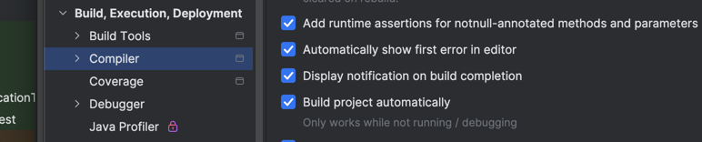

# Project configuration

## How to setup auto reload spring/thymeleaf template Intellij

1. Make the changes in the registry and the base html add websocket script tag
[stackoverflow](https://stackoverflow.com/questions/58275418/live-reload-for-thymeleaf-template)
2. In Intellij options: `Advanced Settings` then `Compiler` `Allow auto-make to start even if developed application is currently running`.
3. `Build project automatically`

4. Add in application.properties `spring.thymeleaf.cache=false`
5. Add a live reload extension to your browser (tested on chrome)
